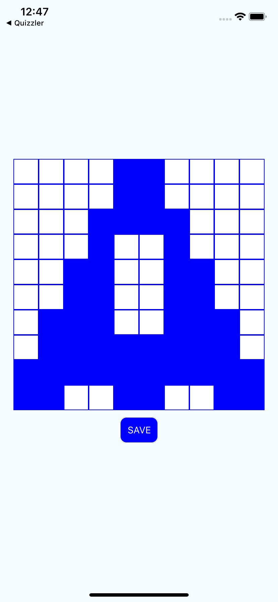

# Grid
Simple React Native app to save grid patterns. This app displays a grid of squares that can be toggled (white/blue). The user can create a pattern and save it in AsyncStorage. The app loads the pattern at startup.

